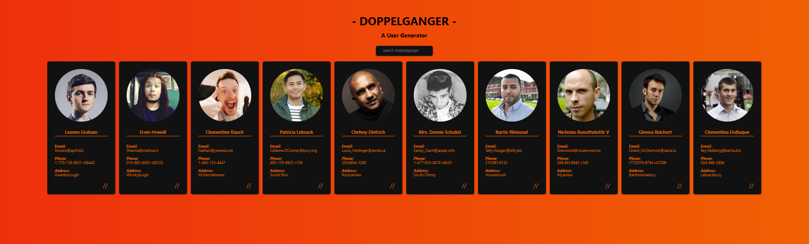

# Doppelganger


> ## A user generator that producing fake male profiles including photos and basic information through APIs
<br>



## Table of Contents

- [Features](#features)
- [Setup](#setup)
- [Maintainers](#maintainers)
- [Contributing](#contributing)
- [License](#license)

## Features
* [Doppelganger Link](https://rathru3704.github.io/React_doppelganger/)
* Fetch JSON data from
    * https://randomuser.me
    * https://jsonplaceholder.typicode.com/
* Provide a seach box to search key words.
* Style the interface by utilizing Tachyons.

## Setup
* This project uses [node](http://nodejs.org) and [npm](https://npmjs.com). Please ensure you have them locally installed.
* Open Git Bash, change the current working directory and type `git clone` syntax:
    ```sh
    $ git clone https://github.com/Rathru3704/React_doppelganger.git
    ```
* Use `npm install` to get all dependencies downloaded and start to run the app:
    ```sh
    $ npm install
    $ npm run start
    ```

## Maintainers

[@Rathru3704](https://github.com/Rathru3704)

## Contributing

Please contribute! [Look at the issues](https://github.com/Rathru3704/React_doppelganger/issues)<br />
PRs accepted.

## License

[MIT](LICENSE) © Arthur Chang